# Moldova Tariff Nomenclature

A complete solution for accessing, processing, and browsing Moldova's customs tariff nomenclature data from trade.gov.md.

**🌐 [Live App](https://vama-md.netlify.app/)** - Browse 15,067 tariff items with instant search and multilingual support

## Overview

This monorepo contains:
1. **Scraper** - Python tools to fetch and process 15,067 tariff items from Moldova's API
2. **Web App** - React SPA for browsing the nomenclature with advanced search

## Architecture

```mermaid
graph TB
    subgraph External
        API[Moldova Trade API<br/>trade.gov.md/api/tarim-nomenclature]
    end

    subgraph "Data Collection Layer"
        Scraper[scraper.py<br/>Sequential Scraper]
        Raw[raw_responses/<br/>page_1.json ... page_302.json<br/>15,067 items]
    end

    subgraph "Data Processing Layer"
        Processor[processor.py<br/>Tree Builder]
        Flat[data/nomenclature_flat.json<br/>14.7MB - Flat array with paths]
        Tree[data/nomenclature_tree.json<br/>9.5MB - Nested hierarchy]
    end

    subgraph "Presentation Layer (React SPA)"
        WebApp[web/src/pages/Home.jsx<br/>Main Component]
        Display[Display Features]
        Search[Search Engine]

        WebApp --> Display
        WebApp --> Search

        Display --> |Visual Indentation|Render[Hierarchical Rendering<br/>15,067 items]
        Display --> |Click to Copy|Clipboard[Clipboard Integration]

        Search --> |Debounced 150ms|Filter[Filter Logic]
        Filter --> |Diacritics-insensitive|Normalize[normalizeText&#40;&#41;]
        Filter --> |Wildcard *|Prefix[Prefix Matching]
    end

    subgraph "Deployment"
        Build[npm run build]
        Dist[dist/<br/>Production Build]
        Netlify[Netlify CDN<br/>vama-md.netlify.app]
    end

    API -->|302 pages × 50 items<br/>Rate-limited: 2-3s delays| Scraper
    Scraper -->|Save individually<br/>Resume-safe| Raw
    Raw -->|Read all files<br/>Build lookups| Processor
    Processor -->|Transform & Sort| Flat
    Processor -->|Build hierarchy<br/>Sort by &#40;nc=='', nc&#41;| Tree
    Tree -->|Fetch on load<br/>9.5MB JSON| WebApp
    WebApp -->|Flatten with levels<br/>Depth-first traversal| Display

    WebApp --> Build
    Build --> Dist
    Dist --> Netlify

    style API fill:#e1f5ff
    style Scraper fill:#fff4e1
    style Processor fill:#fff4e1
    style WebApp fill:#e8f5e9
    style Netlify fill:#f3e5f5
    style Tree fill:#ffebee
```



**Data Flow Summary:**
1. **Scraper** fetches paginated API responses (302 pages, ~12-15 min)
2. **Processor** transforms flat data into hierarchical tree structure
3. **Web App** loads tree JSON, flattens it, and provides instant search
4. **Deployment** builds static site and deploys to Netlify CDN

**Key Design Decisions:**
- **Resume-safe scraping**: Individual page files allow safe interruption
- **Dual formats**: Flat JSON for analysis, tree JSON for display
- **Client-side flattening**: Tree flattened on load for O(1) search
- **No virtualization**: Modern browsers efficiently handle 15k items
- **Proper ordering**: NC codes sorted first at each hierarchy level

## Quick Start

### Web App (Recommended)

```bash
cd web
npm install
npm run dev
```

Open http://localhost:5173 to browse the nomenclature.

### Scraper (Data Collection)

```bash
cd scraper
pip install -r requirements.txt

# Test scraper (dry run - first page only)
python scraper.py --dry-run

# Full scrape (~12-15 minutes)
python scraper.py

# Process raw data into structured formats
python processor.py

# Copy processed data to web app
cp data/nomenclature_tree.json ../web/public/data/
```

## Project Structure

```
├── scraper/                    # Python data collection tools
│   ├── scraper.py              # API scraper (sequential, rate-limited)
│   ├── processor.py            # Data processor (builds tree/flat formats)
│   ├── search.py               # CLI keyword search utility
│   ├── stats.py                # Statistics viewer
│   ├── requirements.txt        # Python dependencies
│   ├── raw_responses/          # Raw API responses (gitignored)
│   ├── data/                   # Processed data (gitignored)
│   └── logs/                   # Scraping logs (gitignored)
│
├── web/                        # React SPA for browsing
│   ├── src/
│   │   ├── pages/
│   │   │   ├── Home.jsx        # Main list view with search
│   │   │   └── Category.jsx    # Detail view (unused)
│   │   ├── App.jsx             # Main app layout
│   │   └── App.css             # Styling
│   ├── public/
│   │   └── data/               # Processed JSON (nomenclature_tree.json)
│   ├── netlify.toml            # Netlify deployment config
│   └── package.json
│
└── README.md                   # This file
```

## Features

### Web App
- **Hierarchical display**: All 15,067 items with visual indentation
- **Instant search**: Debounced (150ms) with diacritics-insensitive matching
- **Wildcard search**: Use `*` suffix (e.g., `0101*`) for prefix matching on NC codes
- **Clipboard copy**: Click any NC code to copy to clipboard with toast notification
- **Multilingual**: Displays Romanian, Russian, and English names
- **Responsive**: Clean 700px centered layout
- **Fast**: Renders full flattened tree with browser optimizations

### Scraper
- **Resume capability**: Skips already-downloaded files
- **Rate limiting**: 2-3 seconds between requests with exponential backoff
- **Safety net**: All raw responses saved individually
- **Progress tracking**: Detailed logging to console and file
- **Error handling**: Retries with exponential backoff on network errors

### Processor
- **Tree structure**: Builds proper hierarchical JSON with nested children
- **Proper ordering**: NC codes first, then empty values (category headers)
- **Multilingual**: Preserves all languages (EN, RO, RU)
- **Regulatory info**: Import/export/transit acts included
- **Statistics**: Depth analysis, act counts, etc.

## Data Format

### Tree JSON Structure (used by web app)
```json
[
  {
    "id": 61032,
    "nc": "0101",
    "name_en": "Horses, asses, mules and hinnies, live",
    "name_ro": "Cai, măgari, catâri şi bardoi, vii",
    "name_ru": "Лошади, ослы, мулы и лошаки, живые",
    "import_acts": [...],
    "export_acts": [...],
    "transit_acts": [...],
    "children": [
      {
        "id": 61033,
        "nc": "",
        "name_en": "– Horses:",
        "children": [...]
      }
    ]
  }
]
```

Properly ordered at each level: items with NC codes first (sorted), then category headers without codes.

## Deployment

### Netlify
The web app is configured for Netlify deployment:

```bash
cd web
npm run build
```

Deploy the `dist/` folder to Netlify. The `netlify.toml` handles:
- SPA routing redirects
- Cache headers for static assets
- Optimal serving of the 9.5MB nomenclature_tree.json

## Data Statistics

- **Total items**: 15,067
- **Root categories**: 1,262 (no parent)
- **Leaf items**: 9,889 (most specific classifications)
- **Hierarchy depth**: Up to 9 levels
- **With import acts**: 3,520+ items
- **Data size**: 9.5MB (tree JSON), 14.7MB (flat JSON)

## API Information

- **Base URL**: `https://trade.gov.md/api/tarim-nomenclature/`
- **Total pages**: 302 (50 items per page)
- **Data structure**: Flat paginated list with parent/child relationships
- **Rate limits**: None specified (scraper uses 2-3 sec delays)

## Search Examples

### Web App
- `cai` → matches "Cai, măgari, catâri şi bardoi, vii" (ignores diacritics)
- `0101*` → shows all NC codes starting with 0101
- `furniture` → searches across all language fields

### CLI (scraper/search.py)
```bash
python search.py "mobilă" --lang=ro --limit=10
python search.py "textile" --acts
```

## License

Data sourced from Moldova's official trade.gov.md API. Check their terms of use for data usage rights.
