# Moldova Tariff Nomenclature

A complete solution for accessing, processing, and browsing Moldova's customs tariff nomenclature data from trade.gov.md.

**🌐 [Live App](https://vama-md.netlify.app/)** - Browse 15,067 tariff items with instant search and multilingual support

## Overview

This monorepo contains:
1. **Scraper** - Python tools to fetch and process 15,067 tariff items from Moldova's API
2. **Tax Scraper** - Fetches VAT, customs duties, and excise tax data for all NC codes
3. **Web App** - React SPA for browsing the nomenclature with advanced search and tax information

## Architecture

```mermaid
graph TB
    subgraph External
        API[Moldova Trade API<br/>trade.gov.md/api/tarim-nomenclature]
    end

    subgraph "Data Collection Layer"
        Scraper[scraper.py<br/>Sequential Scraper]
        Raw[raw_responses/<br/>page_1.json ... page_302.json<br/>15,067 items]
    end

    subgraph "Data Processing Layer"
        Processor[processor.py<br/>Tree Builder]
        Flat[data/nomenclature_flat.json<br/>14.7MB - Flat array with paths]
        Tree[data/nomenclature_tree.json<br/>9.5MB - Nested hierarchy]
        TaxScraper[tax_scraper.py<br/>Tax Data Collector]
        TaxData[tax_responses/<br/>12,661 tax files]
        Merger[merge_tax_data.py<br/>Data Merger]
        TreeWithTax[data/nomenclature_tree_with_tax.json<br/>Enhanced with tax info]
    end

    subgraph "Presentation Layer (React SPA)"
        WebApp[web/src/pages/Home.jsx<br/>Main Component]
        Display[Display Features]
        Search[Search Engine]

        WebApp --> Display
        WebApp --> Search

        Display --> |Visual Indentation|Render[Hierarchical Rendering<br/>15,067 items]
        Display --> |Click to Copy|Clipboard[Clipboard Integration]

        Search --> |Debounced 150ms|Filter[Filter Logic]
        Filter --> |Diacritics-insensitive|Normalize[normalizeText&#40;&#41;]
        Filter --> |Wildcard *|Prefix[Prefix Matching]
    end

    subgraph "Deployment"
        Build[npm run build]
        Dist[dist/<br/>Production Build]
        Netlify[Netlify CDN<br/>vama-md.netlify.app]
    end

    API -->|302 pages × 50 items<br/>Rate-limited: 2-3s delays| Scraper
    Scraper -->|Save individually<br/>Resume-safe| Raw
    Raw -->|Read all files<br/>Build lookups| Processor
    Processor -->|Transform & Sort| Flat
    Processor -->|Build hierarchy<br/>Sort by &#40;nc=='', nc&#41;| Tree
    API -->|Tax data for 12,661 NC codes<br/>Rate-limited: 1-1.5s delays| TaxScraper
    TaxScraper -->|Individual JSON files<br/>Resume-safe| TaxData
    Tree -->|Base hierarchy| Merger
    TaxData -->|Tax info lookup| Merger
    Merger -->|Merge tax_info into items| TreeWithTax
    TreeWithTax -->|Fetch on load<br/>Enhanced JSON| WebApp
    WebApp -->|Flatten with levels<br/>Depth-first traversal| Display

    WebApp --> Build
    Build --> Dist
    Dist --> Netlify

    style API fill:#e1f5ff
    style Scraper fill:#fff4e1
    style Processor fill:#fff4e1
    style TaxScraper fill:#fff4e1
    style Merger fill:#fff4e1
    style WebApp fill:#e8f5e9
    style Netlify fill:#f3e5f5
    style TreeWithTax fill:#ffebee
```



**Data Flow Summary:**
1. **Scraper** fetches paginated API responses (302 pages, ~12-15 min)
2. **Processor** transforms flat data into hierarchical tree structure
3. **Tax Scraper** fetches VAT, customs, and excise data for all NC codes (~4.4 hours)
4. **Merger** combines nomenclature tree with tax information
5. **Web App** loads enhanced JSON, flattens it, and provides instant search with tax data
6. **Deployment** builds static site and deploys to Netlify CDN

**Key Design Decisions:**
- **Resume-safe scraping**: Individual page files allow safe interruption
- **Dual formats**: Flat JSON for analysis, tree JSON for display
- **Client-side flattening**: Tree flattened on load for O(1) search
- **No virtualization**: Modern browsers efficiently handle 15k items
- **Proper ordering**: NC codes sorted first at each hierarchy level

## Quick Start

### Web App (Recommended)

```bash
cd web
npm install
npm run dev
```

Open http://localhost:5173 to browse the nomenclature.

### Scraper (Data Collection)

```bash
cd scraper
pip install -r requirements.txt

# Test scraper (dry run - first page only)
python scraper.py --dry-run

# Full scrape (~12-15 minutes)
python scraper.py

# Process raw data into structured formats
python processor.py

# Scrape tax information (VAT, customs, excise) for all NC codes
python tax_scraper.py --dry-run  # Test with first 3 codes
python tax_scraper.py            # Full scrape (~4.4 hours, resumable)

# Merge tax data with nomenclature
python merge_tax_data.py

# Copy enhanced data to web app
cp data/nomenclature_tree_with_tax.json ../web/public/data/
```

## Project Structure

```
├── scraper/                    # Python data collection tools
│   ├── scraper.py              # API scraper (sequential, rate-limited)
│   ├── processor.py            # Data processor (builds tree/flat formats)
│   ├── tax_scraper.py          # Tax data scraper (VAT, customs, excise)
│   ├── merge_tax_data.py       # Merges tax data with nomenclature
│   ├── search.py               # CLI keyword search utility
│   ├── stats.py                # Statistics viewer
│   ├── requirements.txt        # Python dependencies
│   ├── raw_responses/          # Raw API responses (gitignored)
│   ├── tax_responses/          # Tax data responses (gitignored)
│   ├── data/                   # Processed data (gitignored)
│   ├── logs/                   # Scraping logs (gitignored)
│   └── TAX_SCRAPER_README.md   # Tax scraper documentation
│
├── web/                        # React SPA for browsing
│   ├── src/
│   │   ├── pages/
│   │   │   ├── Home.jsx        # Main list view with search and tax data
│   │   │   └── Category.jsx    # Detail view (unused)
│   │   ├── config/
│   │   │   └── countries.js    # Country list for customs rates
│   │   ├── App.jsx             # Main app layout
│   │   └── App.css             # Styling
│   ├── public/
│   │   └── data/               # Processed JSON (nomenclature_tree_with_tax.json)
│   ├── netlify.toml            # Netlify deployment config
│   └── package.json
│
├── README.md                   # This file
└── CLAUDE.md                   # Claude Code instructions
```

## Features

### Web App
- **Hierarchical display**: All 15,067 items with visual indentation
- **Tax information**: VAT rates, customs duties (by country), and excise taxes
- **Country selector**: Choose from 60+ countries to view specific customs rates
- **Instant search**: Debounced (150ms) with diacritics-insensitive matching
- **Advanced search modes**:
  - Wildcard: `0101*` for prefix matching on NC codes
  - Exact: `"horse"` for exact phrase matching
  - Multi-word: All words must match in any name field
  - Numeric: Automatic NC code search with space/dot tolerance
- **Search highlighting**: Matched terms highlighted in results
- **Context-aware results**: Shows matched items with their parents and children
- **Clipboard copy**: Click any NC code to copy to clipboard with toast notification
- **LLM export**: Download entire dataset as hierarchical markdown (~75MB)
- **ChatGPT integration**: Quick access to AI-assisted tariff classification
- **Multilingual**: Displays Romanian, Russian, and English names
- **Responsive**: Clean layout optimized for data tables
- **Virtualized rendering**: Efficient display of 15k+ items with react-window

### Scraper
- **Resume capability**: Skips already-downloaded files
- **Rate limiting**: 2-3 seconds between requests with exponential backoff
- **Safety net**: All raw responses saved individually
- **Progress tracking**: Detailed logging to console and file
- **Error handling**: Retries with exponential backoff on network errors

### Tax Scraper
- **Comprehensive coverage**: Fetches tax data for 12,661 unique NC codes
- **Resume capability**: Skips already-fetched files, can resume from any index
- **Rate limiting**: 1-1.5 seconds between requests
- **Robust error handling**: Retries with exponential backoff for 404s, 429s, network errors
- **Progress tracking**: Real-time reports every 100 items, detailed logging
- **Data merging**: Combines tax information with nomenclature tree

### Processor
- **Tree structure**: Builds proper hierarchical JSON with nested children
- **Proper ordering**: NC codes first, then empty values (category headers)
- **Multilingual**: Preserves all languages (EN, RO, RU)
- **Regulatory info**: Import/export/transit acts included
- **Tax integration**: Merges VAT, customs, and excise data into tree structure
- **Statistics**: Depth analysis, act counts, etc.

## Data Format

### Tree JSON Structure (used by web app)
```json
[
  {
    "id": 61032,
    "nc": "0101",
    "name_en": "Horses, asses, mules and hinnies, live",
    "name_ro": "Cai, măgari, catâri şi bardoi, vii",
    "name_ru": "Лошади, ослы, мулы и лошаки, живые",
    "import_acts": [...],
    "export_acts": [...],
    "transit_acts": [...],
    "tax_info": {
      "vat": "20%",
      "excise": "-",
      "tax_values": [
        {
          "country": 1,
          "tax_value": "0%"
        },
        {
          "country": 2,
          "tax_value": "5%"
        }
      ]
    },
    "children": [
      {
        "id": 61033,
        "nc": "",
        "name_en": "– Horses:",
        "children": [...]
      }
    ]
  }
]
```

**Structure notes:**
- Properly ordered at each level: items with NC codes first (sorted), then category headers without codes
- `tax_info` field contains VAT rate, excise tax, and country-specific customs duties
- `tax_values` array provides customs rates for different countries (use country ID to look up)

## Deployment

### Netlify
The web app is configured for Netlify deployment:

```bash
cd web
npm run build
```

Deploy the `dist/` folder to Netlify. The `netlify.toml` handles:
- SPA routing redirects
- Cache headers for static assets
- Optimal serving of the enhanced nomenclature_tree_with_tax.json

## Data Statistics

- **Total items**: 15,067
- **Unique NC codes**: 12,661 (with tax information)
- **Root categories**: 1,262 (no parent)
- **Leaf items**: 9,889 (most specific classifications)
- **Hierarchy depth**: Up to 9 levels
- **With import acts**: 3,520+ items
- **Countries supported**: 60+ (for customs rates)
- **Data size**: Enhanced tree JSON with tax data, 14.7MB (flat JSON)

## API Information

- **Base URL**: `https://trade.gov.md/api/tarim-nomenclature/`
- **Total pages**: 302 (50 items per page)
- **Data structure**: Flat paginated list with parent/child relationships
- **Rate limits**: None specified (scraper uses 2-3 sec delays)

## Search Examples

### Web App
- `cai` → matches "Cai, măgari, catâri şi bardoi, vii" (ignores diacritics, highlights matches)
- `0101*` → shows all NC codes starting with 0101 (wildcard prefix search)
- `"live animals"` → exact phrase match (wrapped in quotes)
- `0101 21 000` → finds NC code (spaces ignored in numeric search)
- `furniture wood` → both words must match (multi-word search)
- Select a country from dropdown to view country-specific customs rates

### CLI (scraper/search.py)
```bash
python search.py "mobilă" --lang=ro --limit=10
python search.py "textile" --acts
```

## License

Data sourced from Moldova's official trade.gov.md API. Check their terms of use for data usage rights.
